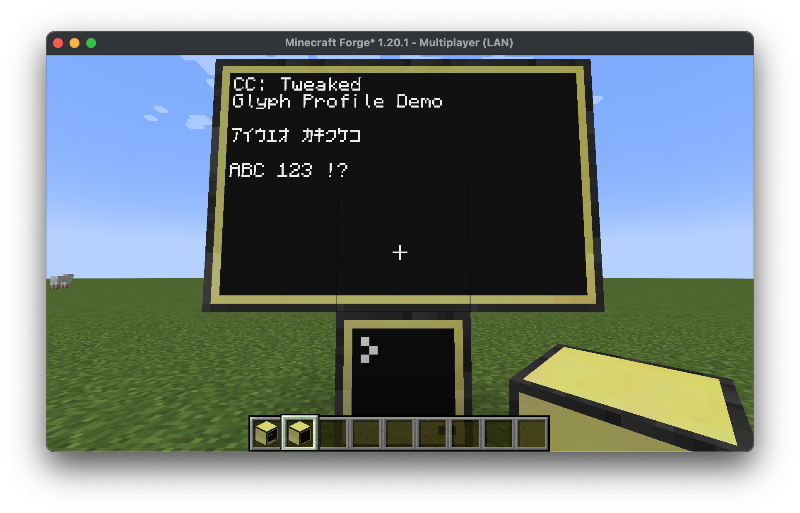
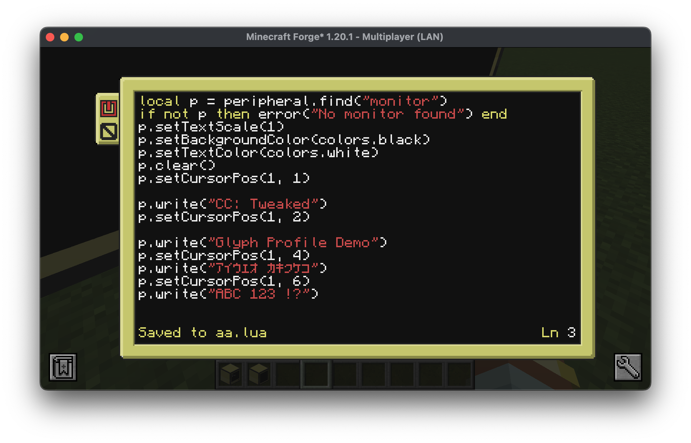
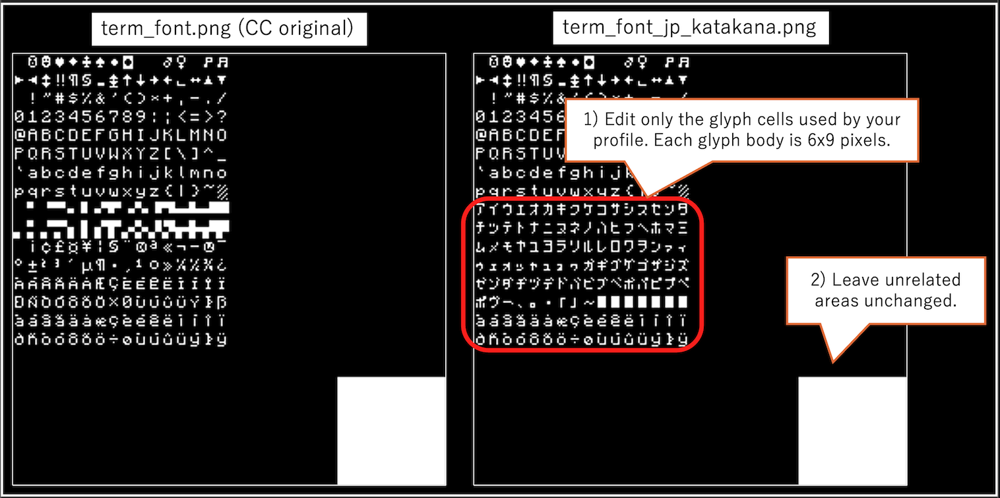

<!--
SPDX-FileCopyrightText: 2017 The CC: Tweaked Developers

SPDX-License-Identifier: MPL-2.0
-->

<picture>
  <source media="(prefers-color-scheme: dark)" srcset="./doc/logo-darkmode.png">
  <source media="(prefers-color-scheme: light)" srcset="./doc/logo.png">
  
</picture>

# CC: Tweaked Glyph Profiles Fork
## 概要

この fork は、upstream の最新版ではなく、CC: Tweaked 1.113.1（Minecraft Java版 1.20.1 Forge に対応する最終バージョン）をベースにしています。元の CC terminal の固定 256-glyph モデルをできるだけ忠実に保ちながら、terminal の glyph 処理をデータ駆動化しています。

具体的には、表示したい terminal font の PNG 画像（6x9 サイズの字形を 256 個並べたもの）と、その字形に対応する Unicode 文字を定義した profile JSON ファイルを用意することで、256 glyph（字形）の範囲で好きな文字を好きな字形に対応づけて入力・表示できるようになります。なお、サンプルの一つとして日本語カタカナの画像と profile を同梱しています。

## 同梱されているプロファイル

- [`glyph_map_ascii.json`](./projects/core/src/main/resources/assets/computercraft/textures/gui/glyph_map_ascii.json): デフォルトの ASCII 互換 profile です。文字から glyph への対応を定義し、描画には元の CC terminal font PNG である [`term_font.png`](./projects/core/src/main/resources/assets/computercraft/textures/gui/term_font.png) を使います。
- [`glyph_map_jp_katakana.json`](./projects/core/src/main/resources/assets/computercraft/textures/gui/glyph_map_jp_katakana.json): 日本語カタカナの同梱 example profile です。文字から glyph への対応を定義し、対応する terminal font PNG である [`term_font_jp_katakana.png`](./projects/core/src/main/resources/assets/computercraft/textures/gui/term_font_jp_katakana.png) を参照します。

### スクリーンショット

同梱の `jp_katakana` profile を使用した monitor 表示:



スクリーンショットで使用した Lua プログラム:



## 同梱プロファイルを試す

重要: `terminal_glyph_map` を変更しない場合、デフォルトの ASCII profile が使われ、挙動は元の CC terminal font と同じままです。

同梱の日本語カタカナ profile を使うには:

1. ゲームを一度起動し、そのあと終了します。  
   これにより、まだ存在しない場合は CC の client config file が生成されます。
2. Minecraft のインスタンス、または modpack のフォルダ内にある `config/computercraft-client.toml` を開きます。
3. 次の値を設定し、その後もう一度ゲームを起動します:

```toml
terminal_glyph_map = "computercraft:textures/gui/glyph_map_jp_katakana.json"
```

## 独自の Glyph Profile を追加する

1. [`term_font.png`](./projects/core/src/main/resources/assets/computercraft/textures/gui/term_font.png) を `term_font_yourname.png` のような新しいファイルへコピーし、[`terminal-font-edit-example.png`](./doc/screenshots/terminal-font-edit-example.png) に示した編集可能な領域へ glyph を描いてください。  
   各 glyph body は 6x9 pixels です。

2. [`glyph_map_ascii.json`](./projects/core/src/main/resources/assets/computercraft/textures/gui/glyph_map_ascii.json) を `glyph_map_yourname.json` のような新しいファイルへコピーし、次のように編集してください:
   - `font` field が新しい PNG file を指すようにする
   - `map` section に、使いたい Unicode code point と、書き換えた glyph cell の対応を書く
   - 使用するのは Unicode BMP code point (`U+0000` から `U+FFFF`) のみとする

3. 2つの file を mod JAR 内の次の場所へ直接入れてください:

```text
assets/computercraft/textures/gui/
```

そのうえで、`config/computercraft-client.toml` の `terminal_glyph_map` を新しい JSON file に向けます。たとえば:

```toml
terminal_glyph_map = "computercraft:textures/gui/glyph_map_hiragana.json"
```

Windows では、[7-Zip](https://www.7-zip.org/) のような tool を使うと、archive 全体を完全展開しなくても JAR を直接開いて必要な folder に file を追加できます。

font 編集の例:



font texture を編集するときは、profile に必要な glyph 領域だけを変更し、それ以外の領域は変更しないのが安全です。詳しい texture の制約や export 時の注意点については、この folder に同梱されている documentation を参照してください。

参考ファイル:

- ベースとなる terminal ASCII font image（CC original）: [`projects/core/src/main/resources/assets/computercraft/textures/gui/term_font.png`](./projects/core/src/main/resources/assets/computercraft/textures/gui/term_font.png)
- ベース profile の参考: [`projects/core/src/main/resources/assets/computercraft/textures/gui/glyph_map_ascii.json`](./projects/core/src/main/resources/assets/computercraft/textures/gui/glyph_map_ascii.json)
- glyph map の例: [`projects/core/src/main/resources/assets/computercraft/textures/gui/glyph_map_jp_katakana.json`](./projects/core/src/main/resources/assets/computercraft/textures/gui/glyph_map_jp_katakana.json)
- font image の例: [`projects/core/src/main/resources/assets/computercraft/textures/gui/term_font_jp_katakana.png`](./projects/core/src/main/resources/assets/computercraft/textures/gui/term_font_jp_katakana.png)
- 詳細な仕様説明（英語）: [`projects/core/src/main/resources/assets/computercraft/textures/gui/TERMINAL_GLYPH_PROFILE_SPEC.txt`](./projects/core/src/main/resources/assets/computercraft/textures/gui/TERMINAL_GLYPH_PROFILE_SPEC.txt)
- 詳細な仕様説明（日本語）: [`projects/core/src/main/resources/assets/computercraft/textures/gui/TERMINAL_GLYPH_PROFILE_SPEC_ja.txt`](./projects/core/src/main/resources/assets/computercraft/textures/gui/TERMINAL_GLYPH_PROFILE_SPEC_ja.txt)

同梱の `jp_katakana` profile は単なる一例であり、この仕組みの限界を示すものではありません。同じ resource-driven structure を使うことで、日本語ひらがなや韓国語ハングルのような追加 profile も可能です。

## 現在の状態

- これは実験的なものであり、公式の CC: Tweaked feature ではありません。
- full internationalisation は目標ではありません。
- 一部の platform では IME direct input がまだ不完全です。
- 特に、IME/OS の組み合わせによっては、conversion を Enter で確定した際に余分な newline が入ることがあります。


## 貢献
この fork への contribution は歓迎します。特に次のような分野は大歓迎です:

- さまざまな platform や input method における IME 関連の testing report
- 母語話者、または十分に使える人による新しい language profile
- glyph-profile behaviour、input handling、terminal rendering の改善

language-profile contribution として最もありがたい形は、次の 2 つの resource の組です:

- glyph-map JSON file
- 対応する terminal font PNG

日本語ひらがなや韓国語ハングルのような追加 writing system 用 profile は、特に歓迎します。


## Upstream Project

この repository は、CC: Tweaked の unofficial fork です。

upstream project はここです:
https://github.com/cc-tweaked/CC-Tweaked

この fork は Minecraft 1.20.1 / CC: Tweaked 1.113.1 系統をベースにしており、terminal rendering と input に experimental な glyph-profile support を追加しています。

CC: Tweaked は Minecraft に programmable computers、turtles、および related peripherals を追加する mod です。そしてそれ自身も、広く愛された [ComputerCraft] の fork です。

この fork は、dan200 と SquidDev への深い敬意と感謝を込めて作られています。

[computercraft]: https://github.com/dan200/ComputerCraft "ComputerCraft on GitHub"
